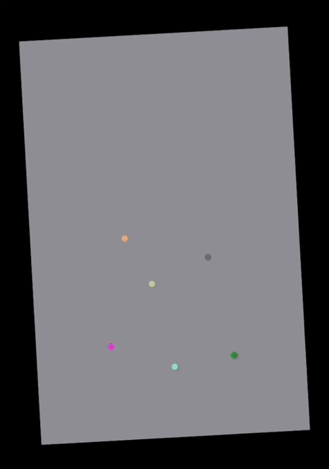

# TransformGesture
<p align="center">
    
    <a href="https://swift.org/about/#swiftorg-and-open-source"></a>
    <a href="https://developer.apple.com/metal/"></a>
   <a href="https://en.wikipedia.org/wiki/MIT_License"></a>
    
</p>

<p align="center">
   <a href="https://github.com/gadirom/TransformGesture"></a>
   
</p>

<p align="left">
   <a href="https://github.com/gadirom/TransformGesture">
</p> 

## Overview

TransformGesture allows you to handle complex gestures such as simultaneous pinching, rotation, and dragging with two fingers in your SwiftUI views.
You get the gesture information via an observable object or/and callbacks.

TransformGesture automatically generates transformation effects and matrices for SwiftUI views and Metal objects (so that they perfectly match if you use both technologies in a same view).

## How to use

In your SwiftUI view declare an observed `TouchTransform` object:
```
@StateObject var transform = TouchTransform()
```

Use `transformGesture` modifier on a view that will receive gestures:
```
MyView()
    .transformGesture(transform: transform,
                      draggingDisabled: false,
                      active: true,
                      onTap: onTapCallback)
```

Apply the transformation effect to a SwiftUI view that should be transformed with the gestures:
```
MyViewThatTransforms()
    .transformEffect(transform)
```

Use transformation matrix, or separate parameters of the transformation inside your Metal code:
```
//Swift
let transformMatrix = transform.matrix
let translation = transform.floatTranslation

//Vertex Shader
float3 position = float3(xyCoordinates, 1);

position *= transform;
//or
position += translation;

position *= viewportToDeviceTransform;
out.position = float4(position.xy, 0, 1); 
```

By default if a user performs one finger gesture, TouchTransform will register dragging information in `currentTouch`, and `offset` properties, or a tap gesture in `onTap` callback. You may use this behaviour to allow the user to transform a canvas by two fingers and then drawing on it with one. To obtain the correct coordinates inside the canvas you may use the `matrixInversed` property:
```
let coordinatesInsideView = transform.floatCurrentTouch
let coordinatesInsideCanvas = transform
                                .matrixInveresed
                                .transformed2D(coord)
```
TransformGesture also supports many other features, such as ranges for transformations, snapping, and handling complex behaviours when you deside whether you want to transform a canvas or draw on it depending on the position of a first touch.

For more information see the example app (uses [MetalBuilder](https://github.com/gadirom/MetalBuilder) for showing Metal content overlayed by SwiftUI elements), or read the in-code docs.
